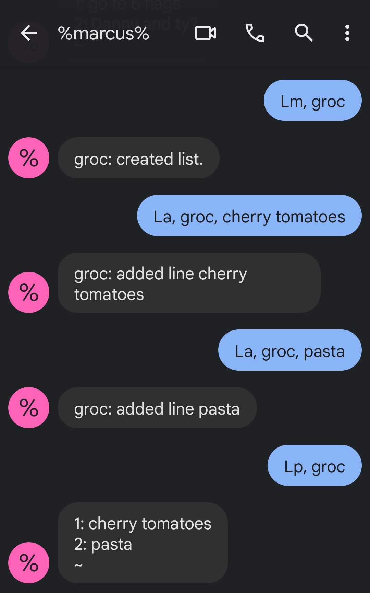

# Marcus

`%marcus%` is an SMS bot that helps you manage your life over text. It's like an interactive shell for your phone!

## List

The List application provides creation and management of lists of text that are stored in the cloud. Use it for reminders or shopping.

  

## Event

The Event application connects to the user's gCal to read/write events.

### Commands

**El** - list today's events.
**Et** - list tomorrow's events.
**Ea** - add an event.
**Ee** - edit an event.

## Deployment

You're gonna need to
1. deploy the stack to your AWS account
2. create a phone number in Twilio
3. give the api gateway endpoint to the number as the primary webhook
